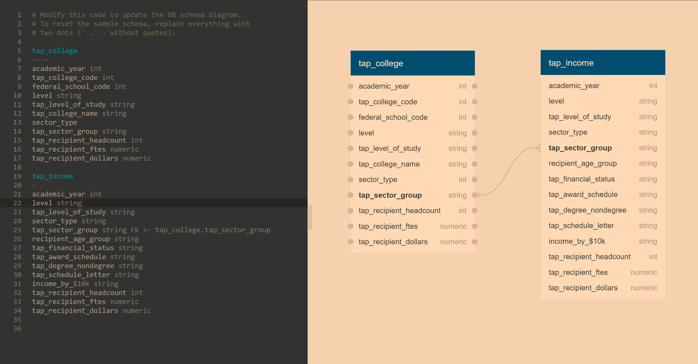

# New York Tuition Assistance Program ETL Project

## Introduction

The New York Tuition Assistance Program (TAP) is a financial aid program for students who are New York residents and are attending colleges in New York. The program awards education grants between $500 and $5,000 to students based on family income, tax status, number of college credits, GPA, and other factors. In this project, we will be performing ETL on data that contains information on TAP awards from the 2018 academic year. Our goal is to produce an organized database for this data in which records can be queried efficiently. 

## Data Extraction

We used two datasets provided by NYC Open Data (an online repository of data published by New York government agencies). The first dataset contains information on TAP recipients by college, sector group, and level of study. The second dataset contains information on TAP recipients by income, age group, and program information. Both datasets have several fields in common, including:

* TAP Level of Study: the level of the educational program the student is enrolled in (4 year undergrad, 2 year undergrad, etc...)
* Sector Type: the sector of the college the student is enrolled in (private or public)
* TAP Sector Group: one of nine categories that New York state schools are assigned to (see dataset for more information)
* TAP Recipient Headcount: number of students who recieved at least one TAP award for a particular college
* TAP Recipient FTEs: a measure that indicates the number of credits the student is enrolled in
* TAP Recipient Dollars: total sum of TAP awards provided to all students for a particular college

The original datasets are saved in the project folder as TAP_Recipients_College_Sector_Group_and_Level_of_Study.csv and TAP_Recipients_Income_Age_Group_and_Program_information.csv.

## Data Transformation

This step consisted of cleaning both datasets so that they could be loaded into the database later on. Pandas was used to convert the csv files into two dataframes: tap_college_df and tap_income_df. For both dataframes, we calculated the proportion of null values present in each column. Fortunately, both dataframes only had a small number of null values, so we decided not to drop any columns. We dropped the few rows that contained null values. Next, we renamed the column headers so that they were all lowercase and used underscores instead of spaces to separate words. This was necessary because our database tables cannot have spaces in the column headers. 

In tap_income_df, student incomes were recorded in three separate columns: "Income by $1,000 Range", "Income by $5,000 Range", and "Income by $10,000 Range". All three columns had the same data - the incomes were just recorded in different ranges. We therefore decided to remove the "Income by $1,000 Range" and "Income by $5,000 Range" columns.

Finally, both cleaned dataframes were saved as csv files in the project folder in case they were needed for future reference.

## Data Loading

This phase of the project consisted of creating the PostgreSQL database and loading the data. Our first step was to design the database using Quick Database Diagrams, which is an online diagram tool. We created two tables: tap_college and tap_income. Tap_college would hold the data in tap_college_df, while tap_income would hold the data in tap_income_df. We gave column headers the same names as the column headers in our cleaned dataframes. We created a relationship between the tap_sector_group columns in both tables, to illustrate how the tables can be joined.

Below is an image of the database design. It is saved in the project folder as ERD_image.png.

Next, we created the tap_db database in pgAdmin, and ran queries to create the tables. The queries can be viewed in the query.sql file in the project folder. We then returned to our Python notebook and used SQL Alchemy to establish a connection to our database. We used Pandas and the SQL Alchemy engine to load the data from both dataframes into their respective tables. Finally, we queried both tables to ensure that the data was loaded correctly. This concludes the final phase of the project.
